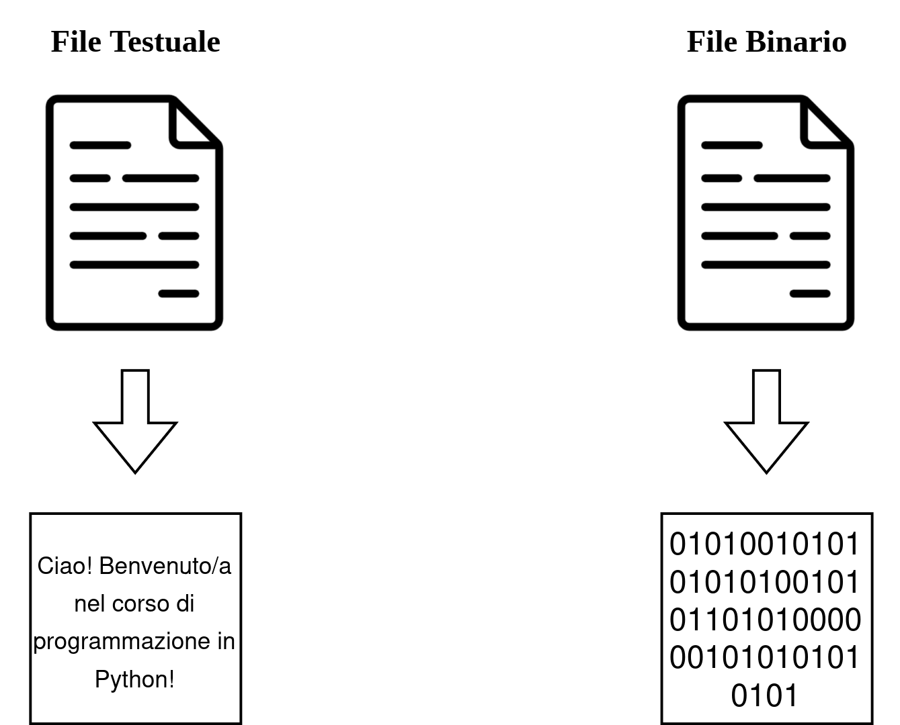

# 📂 File

I **file** sono un mezzo fondamentale per **memorizzare dati in modo permanente**. A differenza delle variabili, che esistono solo durante l’esecuzione del programma, i file consentono di **salvare informazioni** per poterle usare anche in un secondo momento.

## 🤔 Perché lavorare con i file?

I file sono utili per:

- 📝 Salvare dati di input/output in modo permanente.
- 📊 Registrare log o risultati di esecuzioni.
- 🔄 Scambiare dati tra programmi (es. CSV, JSON).
- 📚 Caricare configurazioni o documenti di grandi dimensioni.

## 🗂️ Tipi di file

I file possono essere di diversi tipi, ma i più comuni sono:

- **File di testo** (`.txt`, `.csv`, `.json`, ecc.)  
  Contengono caratteri leggibili.
  
- **File binari** (`.bin`, `.exe`, immagini, audio, ecc.)  
  Contengono dati non leggibili direttamente, codificati in byte.



L'estensione rappresenta solo un'indicazione (utile per capire come interpretare il contenuto) sul contenuto del file, ma non ne determina il formato reale. Un file .txt può contenere dati binari, e un file .bin può essere rinominato .dat senza cambiare il contenuto effettivo.
➡️ È il modo in cui apriamo e interpretiamo il file (in modalità testo o binaria) che fa la differenza nel trattamento dei dati.

✅ Per questo è importante sapere come leggere e scrivere correttamente un file in base al tipo di contenuto che ci aspettiamo.

## 🔐 Modalità di apertura

Quando si lavora con un file, è importante specificare **in che modo** vogliamo interagire con esso. Le modalità principali sono:

| Modalità | Descrizione                          |
|----------|--------------------------------------|
| `r`      | Lettura (default)                    |
| `w`      | Scrittura (sovrascrive il file)      |
| `a`      | Scrittura (aggiunge in fondo)        |
| `x`      | Crea un nuovo file (errore se esiste)|
| `b`      | Modalità binaria                     |
| `t`      | Modalità testo (default)             |
| `+`      | Lettura e scrittura insieme          |

📌 Le modalità possono essere **combinate**. Esempio: `rb` per leggere un file binario.

### 🧩 Combinazioni possibili

Puoi **combinare** alcune modalità per specificare più dettagli:

- `rb` → lettura binaria
- `wb` → scrittura binaria (sovrascrive)
- `ab` → aggiunta binaria
- `r+` → lettura e scrittura (senza creare)
- `w+` → scrittura e lettura (sovrascrive)
- `a+` → lettura e aggiunta
- `rb+`, `wb+`, `ab+` → lettura/scrittura binaria

📌 L’ordine delle lettere non è importante (`rb` = `br`), ma è buona pratica usare quello più leggibile (`r`, `w`, `a`, `x` prima, poi `b`, `t`, `+`).

### ❌ Combinazioni NON valide

Alcune modalità **non possono** essere combinate:

- `r` e `x` insieme → ❌ hanno scopi opposti (lettura vs creazione esclusiva)
- `x+` è valido, ma `xr` no
- `b` e `t` insieme → ❌ sono alternative, non compatibili
- `r` e `w` → ❌ conflitto: `r` apre un file **esistente**, `w` lo **sovrascrive** o crea  
- `a` e `x` → ❌ `a` apre (o crea) un file per **aggiungere**, `x` crea un file **solo se non esiste**  
- `w` e `x` → ❌ entrambe creano file, ma con comportamenti diversi: `w` sovrascrive, `x` fallisce se il file esiste  

✅ Se vuoi **leggere e scrivere**, usa `+` insieme a una modalità principale (`r+`, `w+`, `a+`, `x+`),  
**non combinare due modalità principali tra loro** (`r`, `w`, `a`, `x`).

📎 Ricorda: la modalità `t` (testo) è il default, quindi `r` = `rt`, `w` = `wt`, ecc.

## 🔄 File come flussi di dati

I file vengono trattati come **flussi di caratteri o byte**. Quando leggiamo o scriviamo, ci muoviamo attraverso questo flusso:

- All’apertura, il **cursore** è all’inizio del file.
- Dopo una lettura o scrittura, il cursore avanza.
- Possiamo usare funzioni per **spostare** il cursore (seek) o **tornare all’inizio**.

## 📥 Leggere un file

Leggere un file significa **aprire il file esistente e accedere ai suoi contenuti**. Possiamo leggere:

- Tutto il contenuto in una volta sola.
- Una riga alla volta.
- Un blocco di caratteri.

Proviamo subito a leggere il file `esempio.txt`.

`f` è ora un oggetto di tipo file.

**Come mai non funziona?**

👉 dopo la prima lettura, il 'cursore' si sposta in fondo al file. Quindi le letture successive non restituiranno più dati, a meno che tu non sposti di nuovo il cursore.

Sapendo questo, possiamo anche leggere $x$ caratteri alla volta senza aprire ogni volta il file:

📌 Il simbolo `/` indica che tutti i parametri prima del `/` sono solo posizionali.

## 📤 Scrivere su un file

Scrivere su un file vuol dire **modificare o creare un file inserendo dati**. Possiamo:

- Sovrascrivere il contenuto esistente (`w`).
- Aggiungere (append) nuove righe (`a`).

Entrambe creano il file se non esiste!

⚠️ Se apri un file in modalità `w`, il contenuto esistente verrà **cancellato**.

Quindi, se vuoi scrivere un nuovo contenuto cancellando tutto ciò che c’era prima, puoi usare la modalità `w`:

Se invece vuoi aggiungere nuovo contenuto in fondo al file (senza cancellare), usa la modalità `a` (che significa `append`):

Le modalità possono anche essere combinate, come ad esempio `r+`:

La modalita `r+` permette di leggere e scrivere nel file. Senza però cancellarne il contenuto. Inoltre, se il file non esiste, restituisce un errore.

Possiamo anche utilizzare `w+`, ma in questo caso il file verrà creato se non esiste, oppure sovrascritto:

Invece, con `a+` abbiamo l'apertura in lettura e aggiunta:

## ✅ Uso corretto: apertura e chiusura

Lavorare con i file comporta due fasi fondamentali:

1. **Apertura del file**: specificando il percorso e la modalità.
2. **Chiusura del file**: libera risorse e salva i dati.

🔁 In alternativa, si può usare un **blocco contestuale (`with`)** che chiude il file automaticamente, anche in caso di errore.

## Il costrutto `with` in Python

Il costrutto `with` viene utilizzato per **gestire risorse in modo sicuro e automatico**, come file, connessioni, socket, lock, ecc.

Quando si usa `with`, **non è necessario chiudere manualmente** il file con `close()` — viene fatto **automaticamente anche in caso di errore**.

### 📌 Vantaggi principali:

- ✔️ Chiusura automatica del file  
- ✔️ Codice più pulito e leggibile  
- ✔️ Migliore gestione degli errori  
- ✔️ Evita dimenticanze (es. dimenticare `f.close()`)

## 📁 Percorsi e directory

Un file può trovarsi:

- In una **directory locale** (nella stessa cartella dello script).
- In una **directory relativa** (una sottocartella).
- In un **percorso assoluto** (specificando tutto il cammino nel file system).

Esempi di percorsi:

- `dati.txt` → file nella stessa cartella dello script
- `./documenti/dati.txt` → file in una sottocartella
- `documenti/dati.txt` → file in una sottocartella
- `/Users/nome/Desktop/dati.txt` → percorso assoluto (macOS/Linux)
- `C:\Users\nome\Desktop\dati.txt` → percorso assoluto (Windows)

## 🧪 Lettura e scrittura riga per riga

Quando un file è molto grande, è meglio **leggerlo o scriverlo una riga alla volta**. Questo riduce l’uso di memoria ed è più efficiente.

📌 Leggere riga per riga è utile anche per elaborare contenuti strutturati come CSV o log.

### 🔍 Differenze rispetto a `for line in file`:

| Metodo             | Carica tutto in memoria?     | Più efficiente per file grandi? |
|--------------------|------------------------------|----------------------------------|
| `readlines()`      | ✔️ Sì (lista in memoria)      | ❌ No                            |
| `for line in file` | ❌ No (stream)                | ✔️ Sì                            |

## Facciamo ora qualche esempio pratico!

### 📝 Esercizio: Analisi ordini

Il programma deve leggere un file di testo dove **ogni riga** contiene:
- Il nome di un prodotto
- La quantità desiderata
- La quantità disponibile in magazzino

Lo scopo è determinare **quali prodotti devono essere ordinati** perché la quantità disponibile è **inferiore** a quella desiderata.

#### 📂 Input:
Un file di testo nel formato:

```
mele 9 10
pere 9 8
arance 10 1
albicocche 8 10
```

#### ✅ Output atteso:
Un `set` con i nomi dei prodotti da ordinare:
```python
{"pere", "arance"}
```

#### Soluzione 👀

### 📝 Esercizio: Analisi degli accessi a un sistema

Hai a disposizione un file di log chiamato `accessi.txt`, in cui ogni riga rappresenta un accesso al sistema informatico aziendale.
Ogni riga del file ha il formato:

`username` `data` `ora` `esito`

dove:

- `username`: il nome utente
- `data`: nel formato `YYYY-MM-DD`
- `ora`: nel formato `HH:MM`
- `esito`: può essere `successo` oppure `fallito`

Scrivere una funzione `analizza_accessi(nome_file)` che restituisce un dizionario con:
- come chiavi i nomi utente (`username`)
- come valori una tupla con il numero di accessi **falliti** per ciascun utente e il numero di accessi **riusciti**
  
```python
(falliti, riusciti)
```

- Il numero di accessi riusciti deve considerare solo gli accessi **riusciti** tra le `00:00` e le `03:15`

Se un utente non ha mai fatto accessi falliti ne accessi riusciti, non deve comparire nel dizionario.

#### Soluzione 👀

## 📌 Buone pratiche

- 📏 Verifica che il file esista prima di leggerlo.
- 📂 Usa blocchi `with` per una gestione sicura e automatica della chiusura.
- ⚠️ Non sovrascrivere file importanti senza backup.
- 🔐 Gestisci gli errori con `try`/`except` per evitare crash se il file non è accessibile.

## 🧼 Riepilogo

| Operazione       | Cosa fa                                      |
|------------------|----------------------------------------------|
| Aprire un file   | Crea un ponte tra il programma e il file     |
| Leggere           | Recupera i dati dal file                     |
| Scrivere          | Inserisce dati nel file                      |
| Chiudere          | Libera risorse e completa le operazioni     |

## 🎯 Obiettivo

Lavorare con i file serve a:

- Salvare e riutilizzare dati in modo persistente.
- Interagire con il mondo esterno (input/output).
- Automatizzare lettura e scrittura di grandi quantità di testo o dati.

➡️ Nella prossima lezione vedremo come **gestire file CSV e JSON**, che sono formati molto usati per lo scambio dati!


